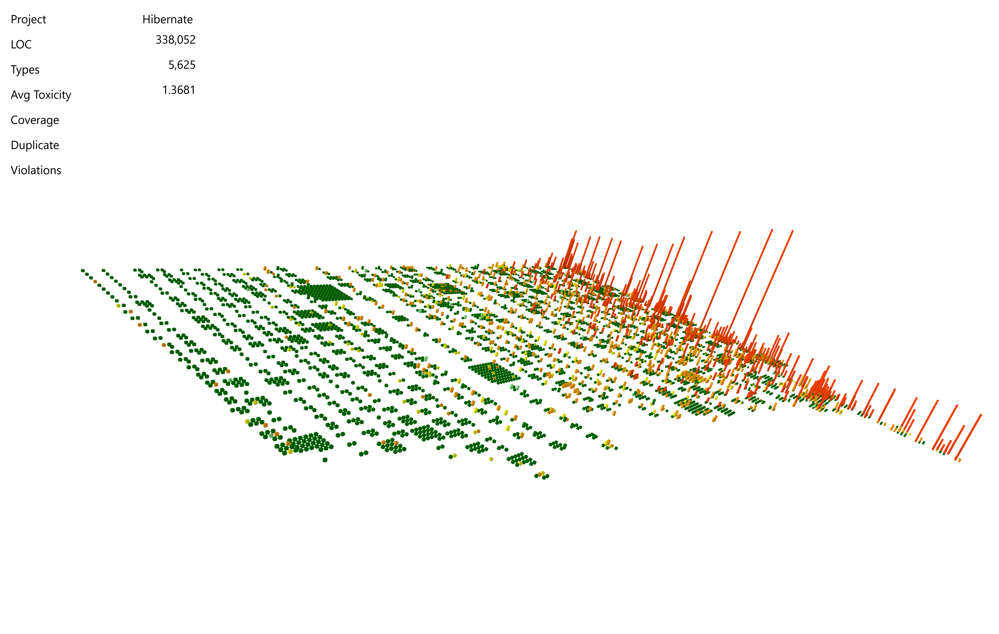

# What is Metropolis?

Metropolis is a code visualization aid to help in review and analysis. It creates 3D representations of modules of code and builds a cityscape  to help reviewers pin point areas of interest. It provides a 3D treemap which uses static code metrics, source control data, and other user data to pin point hotspots in the codebase that warrant more investigation (e.g. cyclomatic complexity, lines of code, number of touches in source control, etc).

## Example

All the green and short buildings are good. The tall red ones need to be looked and reviewed to ensure things get better in those areas.

## How to Install

1. Install NodeJS on [Windows](https://nodejs.org/dist/v6.1.0/node-v6.1.0-x64.msi)
2. Install npm package
`npm install -g metropolis-core`

Currently, Metropolis only support Windows sorry no [WPF on Mono yet](http://www.mono-project.com/docs/gui/wpf/). 
We plan on supporting the command line interface using Mono.

## User Guide

[User Guide Wiki](https://github.com/dahood/metropolis/wiki/User-Guide) - contains info on how to get started after install

## How to anything else...

Learn more by visiting the [project wiki](https://github.com/dahood/metropolis/wiki)

## License

Metropolis is licensed under BSD (see LICENSE).

Metropolis depends on:

* CSVHelper (Dual licensing under MS-PL and Apache 2.0) - http://joshclose.github.io/CsvHelper/
* Newtonsoft.JSON (The MIT License). - https://github.com/JamesNK/Newtonsoft.Json
* ESLint (JQuery Foundation) - https://github.com/eslint/eslint
* Checkstyle (GNU LGPL 2.1) - https://github.com/checkstyle/checkstyle
* D3 (BSD) - https://github.com/mbostock/d3
* radar-chart-d3 (Apache 2.0) - https://github.com/alangrafu/radar-chart-d3
